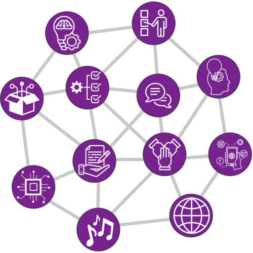

An information architect ensures that your information is <mark>organised</mark> and <mark>presented</mark> in ways that <mark>make sense to the audience</mark>.

When information is designed for the audience:

1. Employees and customers learn more quickly
2. Less time is wasted in looking for and interpreting the information
3. People make fewer mistakes
4. You will attract more customers

### How does information architecture work?

Information architecture brings together three elements:

<aside>
    <figure>
        
        <figcaption>Information architecture triangle</figcaption>
    </figure>
</aside>

- <b>People</b> - the audience for the information and those who will be processing it
- <b>Processes</b> - ensuring information is collected, processed and presented as efficiently as possible, with the appropriate controls in place
- <b>Technology</b> - finding the right tools and systems for a particular context

The aim is to ensure that accurate, up-to-date information is available and findable when people need it, with minimal barriers in place to using and understanding that information. 

### What do I offer?

Every project is different. Some may just involve creating a single document. Others may go as far as redesigning an organisation's internal document management system or web presence.

Most will typically contain elements of the following:

  
Review

  <ul>
    <li>Understand the audience's needs</li>
    <li>Understand the information they need and when they need it</li>
    <li>Review how that information is currently organised and presented</li>
    <li>Review how the information is produced and governed</li>
    <li>Identify the existing information systems</li>
    <li>Identify the current pain points</li>
  </ul>

  
Design

  <ul>
    <li>Create high-level structures</li>
    <li>Create mockups and prototypes</li>
    <li>Test ideas with the target audience</li>
    <li>Iterate towards a final, agreed design - with associated style guide</li>
    <li>Propose system improvements</li>
    <li>Map new processes</li>
  </ul>

  
Build

  <ul>
    <li>Create documents, spreadsheets, web sites, courses, templates etc - as required</li>
    <li>Ensure they meet the style guide</li>
    <li>Ensure products are located correctly in the high-level structure</li>
    <li>Ensure appropriate links between the products</li>    
  </ul>

  
Train

  <ul>
    <li>How to understand your audience</li>
    <li>How to write for your audience</li>
    <li>Information governance in practice</li>
  </ul>

 

### Examples

- **Structure and write your documents** such as requests for proposals, reports, technical manuals, standard operating procedures and policies
- **Rationalise and rework your internal documentation systems**, such as Sharepoint, Confluence, Gitbook, Notion and Xwiki
- **Design and build courses** in Moodle, TalentLMS, Learndash and others
- **Identify and present your key messages** on your website, in slide decks and through data-driven reports

<figure>
    
    <figcaption>Connected web of ideas</figcaption>
</figure>

